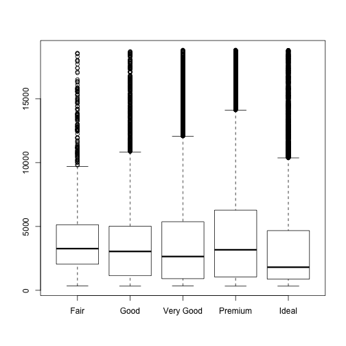
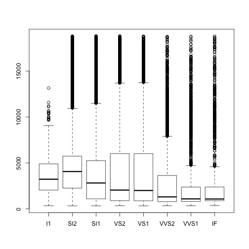

Predict diamond prices using historical data.
========================================================
author: Douglas Young
date: 3/5/2017
autosize: true

Motivation
========================================================

The worldwide retail market for diamonds was $60 billion in 2010 [http://www.cnbc.com/id/48782968]. Using historical data we can offer a service to predict the prices of diamonds for people curious about the worth of their diamonds.

Relationships between diamond features and price
========================================================

We see clear correlation between a diamond's cut and its price.

Relationships between diamond features and price, continued
========================================================

We see clear correlation between a diamond's clarity and its price.

Conclusion
========================================================

By using historical data we can provide a service to individual's who would like to appraise their own diamonds, skipping the middle man. This tool could also be useful for wholesale purchasers and resellers.

While portions of this data shows wide variance around the given outcomes we hypothesize that this variance is a function of local market conditions at the point of sale and not a reflection of an innate variance in the price of diamonds. We would like to continue with this work and collect data around this hypothesis to explore whether we can further refine these models to be even more valuable and useful.
